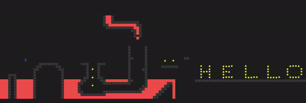

# Jump n' run!
*A small jump & run platformer browser game with customized messages rendered on the map*



### Usage

The following URL query parameters control the message shown as part of the map and also the winning message:
```
?message=<your message>
?won=<your message>
?encoded=<decided if the above strings are base64 encoded>
```
Simply append them to the URL, for example as such: 
```
https://ynnckth.github.io/jumpnrun/?message=hello-world&won=you%20win
```

Use in conjunction with a QR-code generator like:
> https://www.qr-code-generator.com/